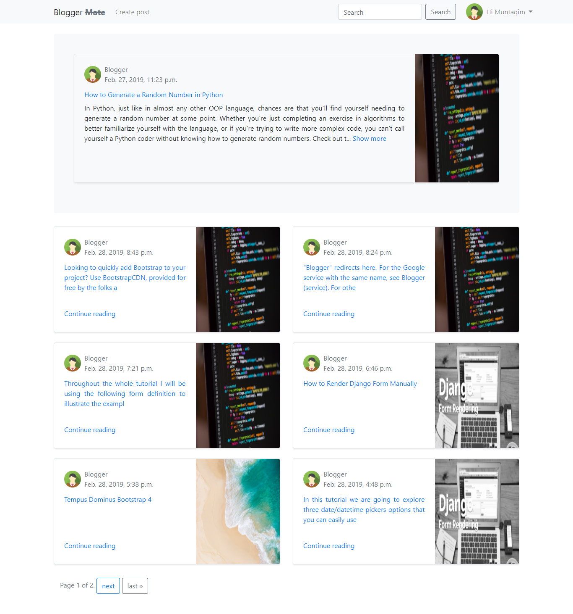
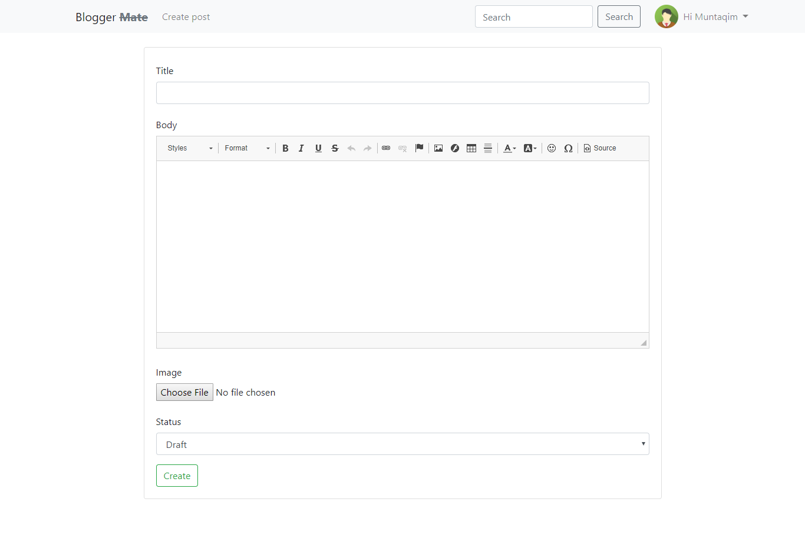
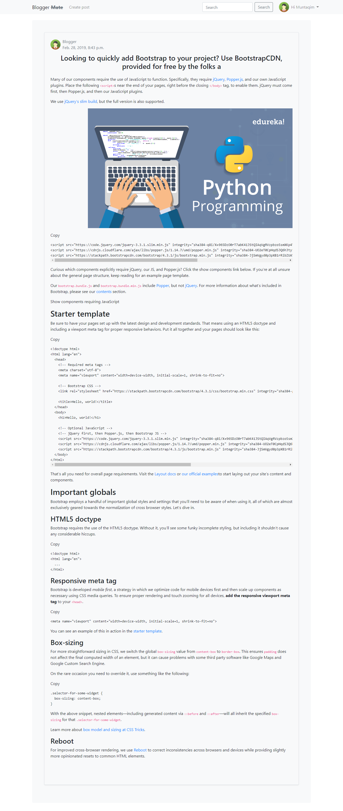
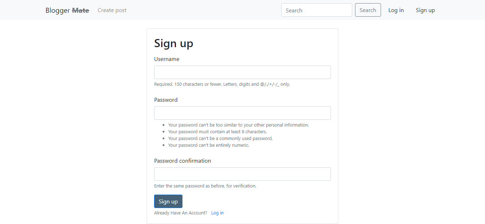
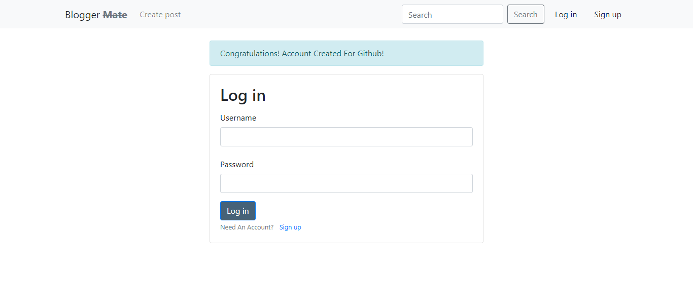
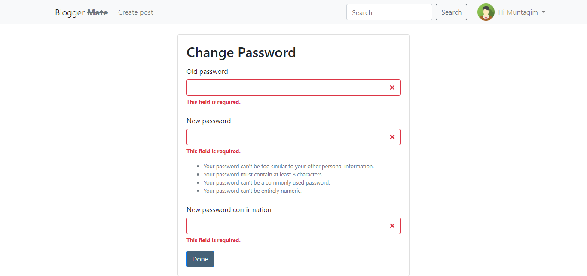

# DjangoBlog_Named_BloggerMate

                              BloggerMate is a blogging platform where indivisual user can 
                              create there account and start writing their blog post .Each 
                              user can see others post but can't update or delete them .Only
                              the author himself can update or delete the written post.  
#Home UI

#PostCreate UI

#PostDetail UI

#PostEdit UI

#PostSearch UI

#Signup UI

#Login UI

#ChangePassword UI

